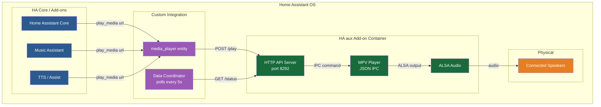

# HA aux : Audio Renderer for Home Assistant

[](https://github.com/adouche-js/HA-aux/actions/workflows/lint.yml)
[](https://github.com/adouche-js/HA-aux/actions/workflows/test.yml)
[](https://github.com/adouche-js/HA-aux/actions/workflows/build.yml)

**HA aux** exposes the physical audio output (Jack/HDMI/USB) of your Home Assistant machine as a native `media_player` entity. It is a pure **audio renderer**, it plays whatever audio stream it receives, nothing more.



## Architecture Overview

### Use cases

- **Music Assistant** → stream multi-room audio to a locally connected speaker
- **TTS (Text-to-Speech)** → speak through physically connected speakers
- **Assist** → voice responses through line-out
- **Automations** → play notification sounds, doorbells, alarms
- **Scripts** → `media_player.play_media()` → audio plays on the Jack output

### What it is NOT

HA aux is **not** a media player, not a Spotify client, not a playlist manager, not a music library. It deliberately handles **none** of these concerns. They are already handled by Home Assistant and Music Assistant.

---

## Table of Contents

- [How It Works](#how-it-works)
- [Architecture](#architecture)
- [Installation](#installation)
- [Configuration](#configuration)
- [Usage](#usage)
- [Compatibility](#compatibility)
- [Keep-Alive Feature](#keep-alive-feature)
- [API Reference](#api-reference)
- [Logs and Troubleshooting](#logs-and-troubleshooting)
- [FAQ](#faq)
- [Development](#development)
- [License](#license)

---

## How It Works

```
┌─────────────────────────────────────────────────────┐
│                  Home Assistant OS                   │
│                                                      │
│  ┌─────────────────┐       ┌──────────────────────┐ │
│  │  HA Core / MA   │       │  HA aux Add-on       │ │
│  │                 │       │  ┌────────────────┐  │ │
│  │  play_media()   │──────▶│  │  HTTP API      │  │ │
│  │  media_player   │       │  │  (port 8292)   │  │ │
│  │                 │◀──────│  │                │  │ │
│  └─────────────────┘       │  └───────┬────────┘  │ │
│         ▲                   │          │           │ │
│         │ poll status      │  ┌───────▼────────┐  │ │
│         │                   │  │  MPV (JSON IPC)│  │ │
│  ┌──────┴────────┐         │  │  audio player  │  │ │
│  │  Custom       │         │  └───────┬────────┘  │ │
│  │  Component    │         │          │           │ │
│  │  media_player │         │  ┌───────▼────────┐  │ │
│  └───────────────┘         │  │  ALSA / ALSA   │  │ │
│                            │  │  audio output  │  │ │
│                            │  └───────┬────────┘  │ │
│                            └──────────┼───────────┘ │
│                                       │             │
│                               ┌───────▼───────┐     │
│                               │  Physical      │     │
│                               │  Speaker(s)    │     │
│                               └───────────────┘     │
└─────────────────────────────────────────────────────┘
```

1. **Add-on** (Docker/Alpine) runs MPV with JSON IPC and an HTTP API server.
2. **Custom component** installed in Home Assistant discovers the add-on and exposes a `media_player` entity.
3. **Music Assistant / HA / TTS** calls `media_player.play_media(url)`.
4. The custom component forwards the URL to the add-on's HTTP API.
5. The add-on tells MPV to load and play the URL through ALSA.
6. The custom component polls the add-on every 5 seconds for status updates.

---

## Architecture

```
ha-aux/
├── repository.yaml              # HA add-on repository manifest
├── addons/
│   └── ha-aux/                  # HA add-on
│       ├── config.yaml          # Add-on configuration schema
│       ├── build.json           # Supervisor build configuration
│       ├── Dockerfile           # Alpine + Python + MPV
│       ├── requirements.txt     # Python dependencies
│       ├── rootfs/              # s6-overlay service files
│       │   └── etc/
│       │       └── s6-overlay/
│       │           └── s6-rc.d/
│       │               └── ha-aux/   # Service definition
│       ├── translations/         # UI labels and descriptions
│       │   └── en.yaml
│       └── src/
│           └── ha-aux_addon/   # Python package
│               ├── __init__.py
│               ├── __main__.py
│               ├── server.py         # HTTP API server (aiohttp)
│               ├── mpv_controller.py # MPV JSON IPC control
│               ├── audio_detector.py # ALSA device detection
│               └── keep_alive.py     # Speaker keep-alive
├── hacs.json                       # HACS integration config
├── custom_components/
│   └── ha_aux/                   # HA integration
│       ├── __init__.py          # Setup + coordinator
│       ├── config_flow.py       # Setup UI + auto-discovery
│       ├── media_player.py      # MediaPlayerEntity
│       ├── manifest.json
│       ├── const.py
│       └── strings.json
├── tests/
│   ├── conftest.py
│   ├── test_mpv_controller.py
│   ├── test_addon_api.py
│   └── test_integration.py
├── .github/workflows/
│   ├── lint.yml
│   ├── build.yml
│   └── test.yml
├── pyproject.toml
├── CHANGELOG.md
└── README.md
```

### Components

| Component | Technology | Role |
|-----------|-----------|------|
| **Add-on** | Alpine + Python 3.13 + MPV | Runs MPV, serves HTTP API, detects audio |
| **Custom component** | HA Integration | Media player entity, proxies commands |
| **Audio engine** | MPV + JSON IPC | Plays audio via ALSA |
| **Audio detection** | /proc/asound + aplay | Auto-selects best output |
| **Keep-alive** | ffmpeg + aplay | Optional speaker standby prevention |

---

## Installation

### Prerequisites

- Home Assistant OS (or supervised installation)
- A physical audio output (Jack, HDMI, USB) connected to speakers
- 64-bit x86 or ARM machine (Raspberry Pi, etc.)

### Step 1: Add the repository to Home Assistant

1. Go to **Settings → Add-ons → Add-on Store**
2. Click the **⋮** menu → **Repositories**
3. Add: `https://github.com/adouche-js/HA-aux`
4. Click **Add**

### Step 2: Install the add-on

1. Find **HA aux Audio Renderer** in the add-on store
2. Click **Install** (this may take a few minutes)
3. Start the add-on (toggle to "Started")
4. Check the logs for audio device detection

### Step 3: Install the custom component

**Option A : HACS (recommended):**

1. Go to **Settings → Add-ons → HACS → Integrations**
2. Click **⋮ → Custom repositories**
3. Add: `https://github.com/adouche-js/HA-aux` (type: Integration)
4. Click **Install** on the HA aux integration
5. Restart Home Assistant

**Option B : Manual:**

1. Copy the `custom_components/ha_aux/` directory to your Home Assistant `config/custom_components/` directory
2. Restart Home Assistant

### Step 4: Configure the integration

The integration should auto-discover the add-on. If not:

1. Go to **Settings → Devices & Services**
2. Click **+ Add Integration**
3. Search for **HA aux Audio Renderer**
4. Verify the API URL (`http://127.0.0.1:8292`) and device name
5. Click **Submit**

### Step 5: Verify

1. Go to **Settings → Devices & Services → HA aux**
2. You should see a `media_player.ha_aux` entity
3. Check the add-on logs for audio device detection

---

## Configuration

### Add-on options

The following options are available in the add-on configuration tab:

| Option | Default | Description |
|--------|---------|-------------|
| `audio_output` | `auto` | ALSA device (`auto`, `hw:0,0`, `hw:0,3`, `hw:1,0`, or device name) |
| `device_name` | `HA aux` | Name of the media player entity |
| `initial_volume` | `50` | Starting volume (0–100) |
| `max_volume` | `100` | Maximum allowed volume (0–100) |
| `keep_alive_enabled` | `false` | Enable speaker standby prevention |
| `keep_alive_interval` | `60` | Seconds between signals (30–600) |
| `keep_alive_duration` | `100` | Signal duration in ms (50–500) |
| `keep_alive_type` | `sine` | Signal type: `sine` or `white_noise` |
| `keep_alive_frequency` | `60` | Sine wave frequency in Hz (20–200) |
| `keep_alive_volume` | `0.01` | Signal volume (0.001–0.1) |

### Integration options

Configured during setup:

| Option | Default | Description |
|--------|---------|-------------|
| API URL | `http://127.0.0.1:8292` | Address of the add-on HTTP API |
| Device Name | `HA aux` | Friendly name for the entity |

### Forcing a specific audio output

If auto-detection selects the wrong device, set `audio_output` to the specific hardware ID:

- `hw:0,0` : Internal analog/Jack (most common)
- `hw:0,3` : HDMI audio
- `hw:1,0` : USB audio device

Find available devices by checking the add-on logs or running:
```bash
aplay -l
```
from the add-on web terminal.

---

## Usage

### With Music Assistant

1. Install Music Assistant (music_assistant integration)
2. Add the HA aux media player as a player in Music Assistant
3. Music Assistant will send audio streams to HA aux automatically

No special configuration needed. Music Assistant sends HTTP streaming URLs;
HA aux plays them. Simple.

### With TTS

```yaml
service: tts.cloud_say
data:
  entity_id: media_player.ha_aux
  message: "The temperature outside is 22 degrees"
```

### With automations

```yaml
alias: "Doorbell sound on speaker"
trigger:
  - platform: state
    entity_id: binary_sensor.doorbell
    to: "on"
action:
  - service: media_player.play_media
    target:
      entity_id: media_player.ha_aux
    data:
      media_content_id: "/media/local/doorbell.mp3"
      media_content_type: "music"
```

### With Assist

Voice responses from Assist are automatically routed to the media player
entity when configured in the Assist pipeline settings.

### Via API (advanced)

```bash
# Play a URL
curl -X POST http://localhost:8292/play \
  -d '{"url": "http://192.168.1.100:8123/media/local/song.mp3"}'

# Pause
curl -X POST http://localhost:8292/pause

# Resume
curl -X POST http://localhost:8292/resume

# Stop
curl -X POST http://localhost:8292/stop

# Set volume to 75%
curl -X POST http://localhost:8292/volume \
  -d '{"volume": 75}'

# Mute
curl -X POST http://localhost:8292/mute \
  -d '{"mute": true}'

# Seek to 30 seconds
curl -X POST http://localhost:8292/seek \
  -d '{"position": 30.0}'

# Get status
curl http://localhost:8292/status

# Health check
curl http://localhost:8292/health
```

---

## Compatibility

### Home Assistant

| Feature | Support |
|---------|---------|
| `media_player.play_media` | ✅ Any URL |
| `media_player.media_pause` | ✅ |
| `media_player.media_play` | ✅ |
| `media_player.media_stop` | ✅ |
| `media_player.volume_set` | ✅ |
| `media_player.volume_mute` | ✅ |
| `media_player.media_seek` | ✅ |
| `media_player.browse_media` | ✅ (empty, no library) |
| Repeat / Shuffle | ❌ Not a music player |
| Next / Previous track | ❌ Not a music player |
| Playlist management | ❌ Not a music player |

### Music Assistant

| Feature | Support |
|---------|---------|
| Streaming via HTTP URL | ✅ Full |
| HLS streams | ✅ Full via MPV |
| Gapless playback | ✅ Handled by MPV |
| Volume control | ✅ |
| Multi-room sync | ✅ Via Music Assistant |
| Power management | ✅ (idle/stop) |

### Platforms

| Platform | Support |
|----------|---------|
| Home Assistant OS (x86_64) | ✅ Primary target |
| Home Assistant OS (aarch64) | ✅ (RPi 3/4/5) |
| Home Assistant OS (armv7) | ✅ (RPi 2/3) |
| Home Assistant Supervised | ✅ |
| Docker standalone | ✅ With manual setup |

---

## Keep-Alive Feature

Some powered speakers automatically enter standby after a period of silence.
The keep-alive feature prevents this by periodically emitting a very low-volume
audio signal.

### When it activates

- The player must be **idle** (no media playing)
- The idle time must exceed the configured interval
- Any playback activity immediately resets the timer
- Keep-alive signals are **never** emitted during active playback

### Signal types

| Type | Description | Best for |
|------|-------------|----------|
| `sine` | Pure tone at configurable frequency | Most speakers |
| `white_noise` | Broadband noise at very low level | Speakers that filter pure tones |

### Effectiveness

The keep-alive feature's effectiveness depends entirely on your speaker hardware.
Some speakers require a certain minimum signal level to stay awake, while others
are triggered by any signal.

**Tuning tips:**
- Start with the defaults (60 Hz sine, 100 ms, 0.01 volume)
- If speakers still go to sleep, try increasing volume or frequency
- If you can hear the signal, reduce volume or switch to a different frequency
- Some speakers respond better to white noise than pure tones
- If your custom WAV file is needed, create a feature request

### When NOT to use keep-alive

- Speakers without auto-standby (waste of resources)
- Tube/valve amplifiers (reduced tube life)
- When you want to save power during idle periods

---

## API Reference

### `GET /health`
Health check.

**Response:**
```json
{
  "status": "ok",
  "version": "1.0.0",
  "mpv_running": true,
  "audio_device": "hw:0,0"
}
```

### `GET /status`
Current playback state.

**Response:**
```json
{
  "state": "playing",
  "volume": 50,
  "muted": false,
  "media_position": 42.5,
  "media_duration": 180.0,
  "media_url": "http://example.com/song.mp3",
  "media_title": "song.mp3",
  "audio_device": "hw:0,0",
  "keep_alive_enabled": false,
  "version": "1.0.0"
}
```

**`state` values:** `playing`, `paused`, `idle`

### `GET /device`
Audio device information.

**Response:**
```json
{
  "current_device": "hw:0,0",
  "available_devices": [
    {"hw_id": "hw:0,0", "name": "HDA Intel PCH Analog", "type": "jack"},
    {"hw_id": "hw:0,3", "name": "HDA Intel PCH HDMI", "type": "hdmi"}
  ],
  "selected": "auto"
}
```

### `POST /play`
Play a media URL.

**Request:**
```json
{"url": "http://example.com/stream.mp3", "title": "My Song"}
```

**Response:** `{"status": "playing", "url": "..."}`

### `POST /pause`
Pause playback. **Response:** `{"status": "paused"}`

### `POST /resume`
Resume playback. **Response:** `{"status": "playing"}`

### `POST /stop`
Stop playback. **Response:** `{"status": "stopped"}`

### `POST /volume`
Set volume.

**Request:** `{"volume": 50}` (0–100)

**Response:** `{"status": "ok", "volume": 50}`

### `POST /mute`
Mute or unmute.

**Request:** `{"mute": true}`

**Response:** `{"status": "ok", "muted": true}`

### `POST /seek`
Seek to absolute position.

**Request:** `{"position": 30.0}` (seconds)

**Response:** `{"status": "ok", "position": 30.0}`

---

## Logs and Troubleshooting

### Viewing logs

**Add-on logs:** Settings → Add-ons → HA aux → Logs

**Integration logs:**
```yaml
# In configuration.yaml
logger:
  default: info
  logs:
    custom_components.ha_aux: debug
```

### Common issues

#### "No audio devices detected"

1. Check that speakers are physically connected
2. Run `aplay -l` in the add-on web terminal
3. Verify ALSA is working: `speaker-test -t sine -f 440 -l 1`
4. Try setting `audio_output` to a specific device like `hw:0,0`

#### "Cannot connect to add-on"

1. Make sure the add-on is started (not just installed)
2. Check that `host_network: true` is set (it is by default)
3. Verify the API URL in the integration configuration
4. Check the add-on logs for errors

#### "MPV exited prematurely"

1. Usually means the audio device is busy or unavailable
2. Check if another service is using the audio device
3. Try a different `audio_output` setting
4. Restart the add-on

#### No sound from Music Assistant

1. Verify Music Assistant can reach the URL it generates (test in browser)
2. Check that HA aux appears as a player in Music Assistant
3. Try playing a direct URL via the API: `curl -X POST http://localhost:8292/play -d '{"url": "http://..."}'`
4. Check MPV is running: `ps aux | grep mpv` in the add-on terminal

---

## FAQ

**Q: Can I use HA aux with Spotify?**  
A: Not directly. Spotify Connect is not supported. Use Music Assistant (which supports Spotify) and route its output to HA aux.

**Q: Does HA aux support AirPlay?**  
A: No. AirPlay is handled by other add-ons. HA aux only plays URLs.

**Q: Can I have multiple HA aux instances?**  
A: Each add-on instance uses one audio output. For multiple physical outputs on the same machine, install multiple add-on instances with different `audio_output` settings (requires manual configuration).

**Q: Does HA aux work with Bluetooth speakers?**  
A: If the Bluetooth speaker appears as an ALSA device, yes. Pair the speaker at the OS level first.

**Q: Why can't I control the volume from the speaker itself?**  
A: HA aux controls MPV's internal volume. The physical speaker volume knob still works but sets the maximum possible output.

**Q: The audio sounds distorted at high volume.**  
A: Lower the `max_volume` setting in the add-on configuration. Physical speakers and their amplifiers have limits.

**Q: Can HA aux play internet radio streams?**  
A: Yes, if you provide the stream URL. But this is better handled by Music Assistant, which has a radio browser.

---

## Development

### Prerequisites

- Python 3.11+
- Docker (for add-on testing)
- Home Assistant development environment (optional)

### Setup

```bash
git clone https://github.com/adouche-js/HA-aux.git
cd HA-aux

# Install development dependencies
pip install -e ".[dev]"

# Or install just the add-on package
pip install -e addons/ha-aux
```

### Running tests

```bash
# Run all tests
pytest tests/ -v

# Run specific test file
pytest tests/test_mpv_controller.py -v

# Run with coverage
pytest tests/ --cov=ha_aux_addon --cov=custom_components.ha_aux
```

### Code style

The project uses [Black](https://github.com/psf/black) and [Ruff](https://github.com/astral-sh/ruff).

```bash
# Format code
black addons/ha-aux/src/ custom_components/ha_aux/ tests/

# Lint
ruff check addons/ha-aux/src/ custom_components/ha_aux/ tests/
```

### Building the Docker image

```bash
docker build -t ha-aux:dev addons/ha-aux/
```

### Project structure

```
addons/ha-aux/src/ha_aux_addon/  # Python package for the add-on
custom_components/ha_aux/          # Home Assistant integration
tests/                            # Test suite
```

### Adding a new API endpoint

1. Add the method to `HaAuxServer` in `server.py`
2. Register the route in `_setup_routes()`
3. Add the corresponding method to `MPVController` if it's a playback command
4. Add the proxy method to `HaAuxMediaPlayer` in `media_player.py`
5. Add tests

### Making a release

1. Update `CHANGELOG.md`
2. Update version in:
   - `addons/ha-aux/src/ha_aux_addon/__init__.py`
      - `addons/ha-aux/config.yaml`
      - `custom_components/ha_aux/manifest.json`
3. Tag the release: `git tag v1.0.0 && git push --tags`
4. GitHub Actions builds and publishes the Docker image

---

## Limitations

- **Single audio output per instance** : one add-on instance → one audio device
- **No hardware mixing** : ALSA lacks advanced mixing; use software mixing via PulseAudio if needed (not included)
- **No Bluetooth natively** : requires OS-level pairing
- **No AirPlay** : use a separate add-on for that
- **No Spotify Connect** : use Music Assistant as intermediary

---

## License

Unlicense (public domain). See [LICENSE](LICENSE).
